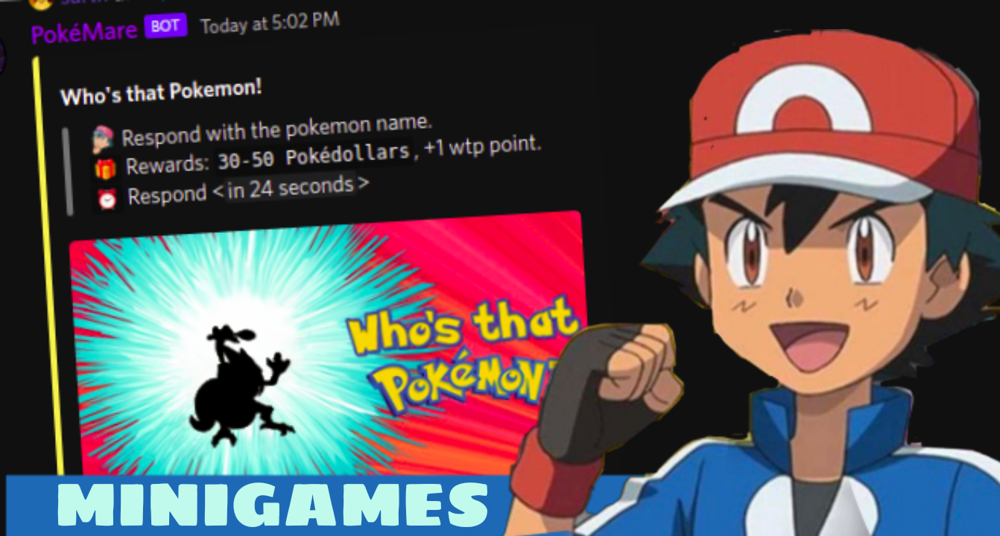

# MINIGAMES

Play minigames and earn rewards!

----

## WHO'S THAT POKEMON.

Bot sends a silhouette of the pokemon. The user needs to guess the name of correct pokemon.

Rewards: 30-50 pokedollars, 1 Who's that pokemon point.

This command has a leaderboard too.